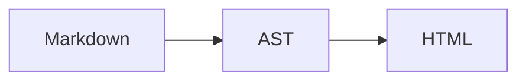

# GitHub Pages 対応ハイブリッド Markdown レポート基盤 MVP 仕様

- 状態: Implemented extended PoC
- 対象: `applications/markdown-explainer/`
- スコープ: 設計・実装（MVP）
- 正本: リポジトリ内の Markdown ファイル

## 1. 決定事項と読者契約

### 1.1 決定

MVP は、GitHub Pages に配置した単一の `index.html` とブラウザ JavaScript が、同じ配信物に含まれる `manifest.json` からレポートを選び、Markdown を取得して HTML に変換する静的 Single Page Application とする。

ビルド時に Markdown をレポート別 HTML へ変換しない。
ビルド処理の役割は、公開対象の検証、マニフェスト生成、参照アセットの収集、ブラウザ資産のバンドル、GitHub Pages 配信物の作成に限定する。

ここでいう「ハイブリッド」は、著者とエージェントが Markdown を正本として編集し、読者には同じ Markdown からブラウザで生成したセマンティックかつインタラクティブな HTML を提示する構成を指す。
サーバーサイドレンダリングとクライアントレンダリングを併用する意味ではない。

主要アーキテクチャはこの一つだけとし、次の代替経路は設けない。

- レポート別の手書き HTML または事前生成 HTML
- API サーバーや既存 FastAPI への実行時依存
- CDN から取得する Markdown パーサーや UI ライブラリ
- パース失敗時に原文や未サニタイズ HTML を表示する縮退表示
- raw HTML、MDX、任意 JavaScript による拡張

### 1.2 目標

1. Markdown の可搬性、GitHub 上の可読性、行単位の Git diff、エージェント入力としての簡潔さを維持する。
2. HTML の視覚密度、セマンティック構造、SVG、指標表示、タブ、折り畳み、音声、数式、Mermaid、2次元レイアウトといったレビュー体験を、少数の宣言的プリミティブで提供する。
3. GitHub Pages のプロジェクトサブパス上で、サーバーと URL rewrite に依存せず直接リンク、再読み込み、戻る／進むを成立させる。
4. レポートソースを非信頼入力として扱い、任意スクリプト、外部埋め込み、危険な URL、危険な SVG を実行しない。
5. 既存 Explainer Sites の Markdown ビューアと配信経路を変更せず、段階的に公開対象を選べるようにする。

### 1.3 読者契約

- `?report=<id>` を含む URL は、同じ配信リビジョン内で常に同じ Markdown レポートを開く。
- `#<heading-slug>` を含む URL は、対象レポートの見出しを直接開く。
- 表示内容の正本は配信物にコピーされた Markdown であり、ブラウザ側に別の本文データを持たない。
- リッチ表示の中だけに主張を閉じ込めない。コールアウト、指標、タブ、SVG、音声には、GitHub 上のソースから意味を追えるテキストを必須とする。
- JavaScript は必須である。無効な場合は `<noscript>` で「この閲覧画面には JavaScript が必要」と明示し、別形式の本文は表示しない。
- レポート、マニフェスト、構文、参照アセットのいずれかが不正な場合は、対象と理由を示すエラー画面を表示し、別レポートの自動選択や部分レンダリングはしない。

### 1.4 著者・運用者契約

- 著者は GFM を基本に記述し、リッチ表現が必要な箇所だけ本仕様のプリミティブを使う。
- 公開対象は Markdown の front matter で明示する。未指定の Markdown はビルド対象外であり、公開漏れを推測で補わない。
- ビルド時検証とブラウザ実行時検証は、同じパーサー・スキーマ・URL ポリシーを共有する。
- ビルドエラーは修正してから再配信する。無効なレポートだけを除外して配信を継続しない。

### 1.5 前提と制約

- **前提:** GitHub Pages で公開してよいレポートだけに `explainer: true` を付ける。
- **前提:** 配信は GitHub Actions が作る Pages artifact を使い、リポジトリ全体をそのまま公開しない。
- **前提:** ブラウザ資産と依存関係は lockfile で固定し、ビルド成果物へ同梱する。
- **制約:** 実行環境は静的 HTML/CSS/JavaScript のみで、サーバー API、データベース、認証、チャット生成は利用しない。
- **制約:** ルート相対 URL を使わない。すべてのアプリ資産、マニフェスト、レポート、アセットは Pages のプロジェクトサブパスを保つ相対 URL とする。
- **制約:** デザインはルート `DESIGN.md` の Apple 系セマンティックトークン、ライト／ダーク、8pt グリッド、44px ターゲット、48–52px の単一行ヘッダーを適用する。

### 1.6 設計判断の根拠

CommonMark は Markdown を構造化文書用のプレーンテキスト形式として定義し、GFM はその仕様化された拡張である [S1][] [S2][]。
GitHub Pages は静的 HTML/CSS/JavaScript を配信でき、`.nojekyll` によって Jekyll 処理を無効化できるため、本構成は Pages の能力だけで成立する [S3][] [S4][]。

Cloudflare が示した 16,180 HTML tokens 対 3,150 Markdown tokens は、Markdown がエージェント入力を小さくできる一例である [S5][]。
ただし、この一例を一般的な圧縮率として扱わない。
HtmlRAG は HTML の構造が検索・取得に有用な場合を示しており、本仕様は Markdown が AI に常に優位だとは主張しない [S9][]。

HTML は SVG、タブ、インタラクション、視覚密度、共有可能なレビュー画面に強く、Markdown は可搬性と編集容易性に強い [S6][]。
一方、独立した反論と Hacker News の議論は、ソース可読性、diff、セキュリティ、既知テンプレートと単純なビルドの価値を指摘する [S7][] [S8][]。
この両立のため、任意 HTML ではなく、AST で検証できる宣言的プリミティブを採用する。

remark の AST／プラグインモデル、`remark-directive`、MyST の directive 形式は、Markdown の可読性を残した拡張の先例である [S12][] [S13][] [S14][]。
出力は WHATWG HTML と MDN が説明するセマンティック HTML、ネイティブ要素、アクセシビリティ API を優先する [S10][] [S11][]。

## 2. アーキテクチャ

### 2.1 構成

```text
Git 管理下
├── applications/markdown-explainer/
│   ├── index.html                 # 静的シェル
│   ├── src/                       # マニフェスト生成とブラウザ実装
│   ├── tests/                     # 単体・統合テスト
│   └── e2e/                       # Pages サブパス E2E
├── article-summaries/**/*.md
├── news/**/*.md
├── note/**/*.md
├── reading/**/*.md
├── researches/**/*.md
└── self-articles/**/*.md

GitHub Pages artifact
├── .nojekyll
├── index.html
├── manifest.json
├── assets/
│   ├── app-<hash>.js
│   ├── theme-init-<hash>.js
│   └── app-<hash>.css
└── content/
    ├── researches/.../report.md
    ├── researches/.../assets/figure.webp
    └── news/.../audio/report.mp3
```

### 2.2 ビルド時の責務

1. 既存 Explainer Sites と同じ六つの report root を再帰走査する。
2. UTF-8 の `.md` のうち、front matter の `explainer` が真であるファイルだけを公開候補とする。
3. 公開候補を共通パーサーで解析し、front matter、見出し、directive、fence、URL、SVG、音声、参照アセットを検証する。
4. すべての公開候補が有効な場合だけ、決定的な `manifest.json` を生成する。
5. 公開 Markdown と、AST から列挙した許可済みローカル画像・音声だけを、リポジトリ相対構造を保って `content/` へコピーする。
6. ブラウザ TypeScript を静的 JavaScript/CSS へバンドルし、`.nojekyll` を含む Pages artifact を作る。
7. artifact を Pages へ配置する。生成した `dist` は Markdown の正本としてコミットしない。

ビルドは本文 HTML を生成しない。
同じ入力、依存バージョン、設定からは byte-for-byte 同一の `manifest.json` を生成し、現在時刻やファイル mtime を含めない。

### 2.3 ブラウザ時の責務

1. `theme-init` が保存済みテーマを初期描画前に `<html data-theme>` へ反映する。
2. アプリが同一 origin の `./manifest.json` を取得し、JSON Schema v1 に厳密一致することを検証する。
3. URL 状態に応じてライブラリ一覧または一つのレポートを選ぶ。
4. 選択した Markdown を同一 origin から取得し、Web Crypto で SHA-256 を計算して manifest の `revision` と一致することを検証する。
5. 検証済み Markdown を共通パーサーで AST 化する。
6. directive と fence を既知のセマンティック HTML AST に変換し、URL 解決、見出し ID 付与、サニタイズを行う。
7. サニタイズ済み fragment だけを `<main>` に挿入し、中央のアプリコードがタブと音声プレイリストのイベントを登録する。
8. `<title>`、`lang`、履歴、フォーカス、ライブリージョンを更新する。

### 2.4 採用する実装モデル

- ビルド: Vite の相対 base (`./`) による静的 bundle と Pages artifact 生成。
- Markdown AST: `unified`、`remark-parse`、`remark-gfm`、`remark-frontmatter`、`remark-directive`、`remark-math`。
- HTML AST: `remark-rehype`、`rehype-raw`、`rehype-katex`、専用変換 handler、`hast-util-sanitize`、`hast-util-to-html`。
- 数式: KaTeX-supported TeX の `$...$`／`$$...$$` を MathML-only output へ変換し、inline style、外部 font、CDNへ依存しない。
- Mermaid: `mermaid` の lockfile 固定版を準備時の構文検証とブラウザ描画に使い、`securityLevel: "strict"`、`htmlLabels: false`、`deterministicIds: true`を設定する。
- 2次元: `board`／`panel` は座標を検証して CSS Grid へ変換し、`plot` は限定JSON LinesからSVGを生成する。
- 見出し slug: `github-slugger` と同じ、文書単位で重複を連番化する規則。
- 実装言語: ブラウザとビルドで共有できる TypeScript。
- UI: フレームワークを導入せず、セマンティック HTML、CSS、最小の DOM イベント処理で構成する。

依存バージョンは実装時の lockfile で固定する。
実行時 CDN は使わない。

## 3. ソース形式と正確な構文

### 3.1 基本文書

ソースは UTF-8、LF の GFM とする。
CommonMark と GFM の標準語彙を利用できる。`remark-gfm` の `singleTilde: false` を使い、表、打ち消し線、タスクリスト、自動リンク、脚注、reference-style link、コード、画像、引用、順序付きリストを含む。
出典には通常の reference-style link を使い、脚注も標準 GFM として扱う。

文書は次の形を必須とする。

```markdown
---
explainer: true
id: hybrid-markdown-mvp
summary: Markdownを正本にしながら、GitHub Pages上でリッチに閲覧する設計。
published: "2026-08-18"
lang: ja
tags:
  - Markdown
  - GitHub Pages
---

# GitHub Pages対応ハイブリッドMarkdown基盤

本文をGFMで記述する。
```

front matter の契約は次のとおりとする。

| キー | 必須 | 型・制約 | 用途 |
| --- | --- | --- | --- |
| `explainer` | 必須 | 真偽値。公開対象は `true` のみ | 明示的な公開 opt-in |
| `id` | 必須 | `^[a-z0-9][a-z0-9-]{0,79}$`、全レポートで一意 | URL の安定識別子 |
| `summary` | 必須 | 改行なしの文字列、1–160文字 | ライブラリ一覧 |
| `published` | 必須 | 引用符付き `YYYY-MM-DD` | 表示と決定的ソート |
| `lang` | 必須 | BCP 47 言語タグ | `<html lang>` と読み上げ |
| `tags` | 必須 | 0–8件の重複しない文字列、各1–32文字 | 一覧の絞り込み |

front matter の未知キー、YAML tag、anchor、alias、複数文書、16 KiB を超える front matter はビルドエラーとする。
front matter を含む Markdown 一ファイルの上限は2 MiB、単一 SVG fence の上限は256 KiBとする。
front matter 直後の最初の本文ノードはレベル1見出しでなければならず、文書内のレベル1見出しは一つだけとする。
この見出しのプレーンテキストをタイトルとし、front matter には重複する `title` を置かない。

`explainer` が存在しない、または `false` の Markdown は本アプリの公開対象ではない。
これはエラー時の除外ではなく、明示された公開集合の定義である。

### 3.2 共通 directive 規則

directive は `remark-directive` の generic directive 構文を使う。
属性値は必ず二重引用符で囲み、未知の属性、重複属性、空の必須属性をエラーとする。
directive 名は小文字固定とする。

本 PoC が認識する directive は次のとおりである。

- container directive: `callout`、`metrics`、`tabs`、`tab`、`details`
- leaf directive: `metric`
- 2次元 container directive: `board`、`panel`

`tab` は `tabs` の直下、`metric` は `metrics` の直下でのみ有効とする。
`tabs` の入れ子、`details` の入れ子、レベル1見出しを directive 内へ置くことは禁止する。
未知の directive は通常テキストへ戻さずエラーとする。

### 3.3 コールアウト

```markdown
:::callout{kind="warning" title="公開範囲を確認"}
`explainer: true` を付けた文書と参照アセットは、GitHub Pagesの配信物に入る。
:::
```

| 属性 | 必須 | 値 |
| --- | --- | --- |
| `kind` | 必須 | `note`、`tip`、`important`、`warning`、`danger` |
| `title` | 任意 | 1–80文字のプレーンテキスト |

本文には GFM と `metrics`、`details`、`svg`／`audio` fence を置ける。
`callout` の入れ子は禁止する。
出力は `<aside>` とし、色だけで状態を伝えず、kind 名に対応する可視ラベルとアクセシブル名を付ける。
初期表示時に読み上げを割り込ませないため `role="alert"` は付けない。

### 3.4 指標グループ

```markdown
:::metrics{label="入力形式の例示比較" columns="3"}
::metric[16,180]{label="HTML" unit="tokens" tone="neutral"}
::metric[3,150]{label="Markdown" unit="tokens" tone="positive"}
::metric[80.5%]{label="例示上の削減率" unit="" tone="positive"}
:::
```

`metrics` の属性は次のとおりとする。

| 属性 | 必須 | 値 |
| --- | --- | --- |
| `label` | 必須 | 1–80文字のグループ名 |
| `columns` | 必須 | `2` または `3` |

`metric` の `[]` は1–32文字のプレーンテキスト値とする。
属性は次のとおりとする。

| 属性 | 必須 | 値 |
| --- | --- | --- |
| `label` | 必須 | 1–80文字 |
| `unit` | 必須 | 0–24文字 |
| `tone` | 必須 | `neutral`、`positive`、`warning`、`negative` |

一つの `metrics` は2–6個の `metric` だけを含む。
値は表示用文字列であり、計算式や実行式として評価しない。
出力は `<section aria-label>` 内の `<dl>` とし、カード状の見た目は CSS だけで与える。

### 3.5 タブ

外側の fence は内側より一つ多いコロン数を使う。

```markdown
::::tabs{id="architecture" label="アーキテクチャの観点"}
:::tab{id="reader" label="読者"}
ブラウザがMarkdownを取得し、同じURL状態からHTMLを再構成する。
:::

:::tab{id="author" label="著者"}
著者はMarkdownだけをレビューし、生成HTMLを正本にしない。
:::
::::
```

`tabs` の属性は次のとおりとする。

| 属性 | 必須 | 値 |
| --- | --- | --- |
| `id` | 必須 | `^[a-z][a-z0-9-]{0,47}$`、文書内で一意 |
| `label` | 必須 | 1–80文字のタブ集合名 |

`tab` の属性は次のとおりとする。

| 属性 | 必須 | 値 |
| --- | --- | --- |
| `id` | 必須 | `^[a-z][a-z0-9-]{0,47}$`、同じ `tabs` 内で一意 |
| `label` | 必須 | 1–40文字 |

一つの `tabs` は2–6個の `tab` を含む。
`tab` 本文には GFM、`callout`、`metrics`、`details`、`svg`／`audio` fence を置けるが、見出しと別の `tabs` は置けない。
最初のタブを初期選択とする。
出力は WAI-ARIA の `tablist`／`tab`／`tabpanel` パターンとし、URL 状態と同期する。

### 3.6 折り畳み

```markdown
:::details{summary="音声原稿" open="false"}
この音声で読み上げる内容を、同じ順序で記載する。
:::
```

| 属性 | 必須 | 値 |
| --- | --- | --- |
| `summary` | 必須 | 1–80文字 |
| `open` | 必須 | `true` または `false` |

本文には GFM、`callout`、`metrics`、`svg` fence を置ける。
見出し、`tabs`、`details`、`audio` fence は置けない。
出力にはネイティブ `<details>`／`<summary>` を使い、独自の開閉 JavaScript は実装しない。

### 3.7 SVG fence

````markdown
```svg {title="描画パイプライン" description="Markdownが検証済みHTMLへ変換される流れ"}
<svg viewBox="0 0 640 160">
  <defs>
    <marker id="arrow" markerWidth="8" markerHeight="8" refX="7" refY="4" orient="auto">
      <path d="M0 0 L8 4 L0 8 Z" fill="var(--accent)" />
    </marker>
  </defs>
  <rect x="16" y="40" width="160" height="72" rx="14" fill="var(--surface)" stroke="var(--separator)" />
  <text x="96" y="82" text-anchor="middle" fill="currentColor">Markdown AST</text>
  <path d="M184 76 H280" stroke="var(--accent)" stroke-width="4" marker-end="url(#arrow)" />
  <rect x="288" y="40" width="160" height="72" rx="14" fill="var(--surface)" stroke="var(--separator)" />
  <text x="368" y="82" text-anchor="middle" fill="currentColor">Sanitized HAST</text>
</svg>
```
````

fence info は `svg` に続けて属性ブロックを一つだけ置く。

| 属性 | 条件 | 値 |
| --- | --- | --- |
| `title` | 非装飾SVGで必須 | 1–120文字 |
| `description` | 非装飾SVGで必須 | 1–240文字 |
| `decorative` | 任意 | `true` または `false`。省略時は `false` |

`decorative="true"` の場合、`title` と `description` は指定せず、出力に `aria-hidden="true"` を付ける。
非装飾の場合、renderer が一意な `<title>` と `<desc>` を挿入し、`role="img"` と `aria-labelledby` を設定する。
SVG 本文に独自の `<title>`／`<desc>` を書かない。

SVG 本文は XML として、ルート要素が一つの `<svg>` であり、`viewBox` を持つことを必須とする。
許可する要素は次に限定する。

```text
svg, g, defs, clipPath, linearGradient, radialGradient, marker,
path, rect, circle, ellipse, line, polyline, polygon, stop, text, tspan
```

許可する属性は次に限定する。

```text
viewBox, preserveAspectRatio, id,
x, y, x1, y1, x2, y2, cx, cy, r, rx, ry, d, points,
width, height, transform, opacity,
fill, fill-opacity, fill-rule,
stroke, stroke-width, stroke-opacity, stroke-linecap, stroke-linejoin,
stroke-dasharray, stroke-dashoffset,
font-size, font-weight, text-anchor,
offset, stop-color, stop-opacity,
marker-start, marker-mid, marker-end, refX, refY, orient, markerWidth, markerHeight
```

`style`、`href`、`xlink:href`、`on*`、外部 URL、`<script>`、`<style>`、`<foreignObject>`、`<image>`、`<use>`、SMIL animation 要素は許可しない。
`url(...)` は同じ SVG 内の `url(#id)` だけを許可する。
CSS 変数は `DESIGN.md` のセマンティックトークンだけを許可し、生の CSS 宣言は書かない。

### 3.8 audio fence

現行 `applications/explainer-sites/serve.py` の `audio` fence と同じキーを使う。
MVP では解釈を次のように厳密化する。

````markdown
```audio
src: ./audio/design-part-01.mp3
title: 設計解説
caption: MVPの主要判断を12分で聞く
label: 前提と構成
src: ./audio/design-part-02.mp3
label: セキュリティと検証
```

:::details{summary="音声原稿" open="false"}
設計解説の全文トランスクリプトを記載する。
:::
````

- 一行は `key: value` とし、空行と `#` から始まるコメント行を許可する。
- キーは `title`、`caption`、`src`、`label` のみとする。
- `title` と `caption` は各0回または1回。`title` 省略時は「音声解説」、`caption` 省略時は `title` と同じ文字列を使う。
- `src` は1–20回。各 `label` は直前の未ラベル `src` にだけ対応し、孤立した `label` と重複 label をエラーとする。
- `src` は Markdown ファイルを基準とする同一 origin の相対パスだけを許可する。
- 音声拡張子は `.aac`、`.flac`、`.m4a`、`.mp3`、`.ogg`、`.opus`、`.wav` に限定する。
- プレーヤーはネイティブ `<audio controls preload="metadata">` を使い、`autoplay` を付けない。
- 複数 `src` は一つのプレーヤーと章リストにし、現在章を `aria-current` で示す。再生終了時は次章へ進む。
- audio fence の直後には、全文トランスクリプトを持つ `details` directive を必須とする。
- GitHub 上で再生できない場合に備え、各 `src` への通常の Markdown ダウンロードリンクも fence の近くに記載する。ビルドはリンク先と `src` の一致を検証する。

### 3.9 通常の GFM とリッチ構文の関係

- 見出し、段落、箇条書き、引用、表、コード、画像、リンク、強調、打ち消し線、タスクリスト、自動リンク、脚注、reference-style link、順序付きリストは常に CommonMark／GFM を使う。
- custom directive は情報の構造と表示方法だけを加え、本文の主張を JavaScript データへ移さない。
- reference-style link は通常の GFM として処理し、GitHub 上でもクリック可能に保つ。
- 通常の code fence はコードとして表示する。`svg`、`mermaid`、`plot`、`audio`だけを定義済みの表示プリミティブとして扱う。
- Markdown の正本には生成 HTML、MathML、Mermaid SVG、CSS Grid の計算結果を保存しない。
- raw HTML は CommonMark の入力として解析するが、受動的なインライン要素の allowlist 以外をエラーとする。

### 3.10 数式

数式は `remark-math` で解析し、`rehype-katex`へ渡す。
インラインは `$...$`、表示数式は `$$...$$` とする。
KaTeX-supported TeX を対象とし、「完全な LaTeX」とは契約しない。

変換オプションは次に固定する。

```text
output: "mathml"
throwOnError: true
trust: false
strict: "error"
maxExpand: 1000
```

入力は文書全体で2 MiB、単一数式で64 KiB以下とする。
`trust: false`により、外部URL、HTML、危険なコマンドを実行する数式は拒否する。
MathML要素と属性は sanitizer の専用 allowlist で再検証する。

### 3.11 Mermaid fence

Mermaid は次の形式で指定する。

````markdown

````

`title` は任意なら既定値を使い、`description` とともに図の accessible name／description へ反映する。
ソースはUTF-8で32 KiB以下、一つのレポートに12個までとする。
`%%{init: ...}%%`、`click`、外部 `href`、callback は許可しない。

ビルド時に lockfile 固定版の `mermaid.parse()`で構文を検証し、ブラウザでは `securityLevel: "strict"`、`htmlLabels: false`、`deterministicIds: true`で描画する。
生成SVGは要素、属性、URL、styleを専用 allowlist で検査してからDOMへ挿入する。
ソースは常に`details`で表示可能にし、図だけに意味を閉じ込めない。

### 3.12 plot fence

plot は自由形式のJavaScriptを許可しない限定データ記法である。

````markdown
```plot {type="line" title="進捗" xLabel="工程" yLabel="件数"}
{"x":"収集","y":2}
{"x":"検証","y":5}
```
````

`type` は `bar`、`line`、`scatter` のいずれか、データはJSON Linesの2–24行とする。
各行は `x`（1–80文字の文字列）と `y`（有限な数値）だけを持つ。
レンダラーは決定的な `<figure>`、accessible SVG、表示元データの`details`を生成する。
自由形式のchart DSL、式評価、データfetchは行わない。

### 3.13 board／panel

HTMLの2次元レイアウトは座標付きdirectiveで宣言する。

````markdown
::::board{label="責務" columns="3"}
:::panel{title="正本" x="1" y="1" w="1" h="2"}
Markdown本文。
:::
:::panel{title="表示" x="2" y="1"}
HTML表示。
:::
::::
````

`board` の `columns` は2–4、panelは1–12個、行は最大6とする。
panelの `title`、`x`、`y` は必須、`w` と `h` は省略時1である。
座標はboardの範囲内、panel同士は重複なし、panelはboardの直下、source順はDOM順とする。
出力は `<section>`、`<article>`、CSS Gridであり、画面幅640px以下ではpanelをsource順の一列へ積む。

### 3.14 受動的 raw HTML

任意HTMLではなく、次のインライン要素だけを許可する。

```text
abbr, cite, del, em, ins, kbd, mark, q, s, samp, small,
span, strong, sub, sup, time, u, var, br
```

許可属性は `abbr[title]`、`q[cite]`、`span[title]`、`time[datetime]`だけとする。
`class`、`id`、`style`、`data-*`、ARIA属性、見出し、画像、音声、button、form、script、SVGはsource raw HTMLから指定できない。
これにより、sourceがrenderer所有のcomponentや見出しを偽装することを防ぐ。

## 4. レンダリングパイプライン

### 4.1 共通パーサー

Node のマニフェスト生成とブラウザ描画は、同じ TypeScript module と JSON Schema を import する。
一方だけに構文、URL、sanitize の規則を実装しない。

処理順は次に固定する。

1. **入力制限:** UTF-8 decode、front matter 16 KiB 上限、文書サイズ上限を検証する。
2. **Markdown parse:** CommonMark を基礎に GFM、front matter、directive を mdast へ解析する。
3. **文書検証:** front matter、単一 H1、見出し順序、未知 directive、入れ子、属性、fence を検証する。
4. **プリミティブ変換:** 既知 directive と fence を専用 mdast node へ変換する。文字列を HTML として連結しない。
5. **mdast → hast:** 専用 handler で標準 HTML/SVG/MathML node を生成し、受動的 raw HTMLだけを `rehype-raw` で解釈する。
6. **URL 解決:** リンク、画像、audio を Markdown 取得 URL を基準に正規化し、許可ポリシーを適用する。
7. **見出し ID:** 見出しのプレーンテキストから GFM 互換 slug を生成し、重複は `-1`、`-2` の順に付ける。
8. **sanitize:** 専用 `hast-util-sanitize` schema で HTML/SVG/MathML 要素と属性を再検証する。
9. **serialize:** サニタイズ済み HAST を HTML 文字列へ変換し、`template` element で fragment 化する。
10. **commit:** 全工程が成功した場合だけ、既存 `<main>` を `replaceChildren` で置き換える。
11. **enhance:** アプリ自身が生成した `data-component` にだけ、タブ、音声、Mermaidの描画を登録する。board／plot／数式はDOMとCSSだけで表示する。
12. **state update:** `<title>`、`lang`、目次、URL、フォーカス、`aria-live` を更新する。

`rehype-raw` は受動的 raw HTMLの検証後に限って使う。
report sourceのraw HTMLをそのままDOMへ挿入する経路は持たない。

### 4.2 出力する主なセマンティクス

| ソース | HTML |
| --- | --- |
| 文書本文 | `<article aria-labelledby="report-title">` |
| コールアウト | `<aside aria-labelledby>` |
| 指標 | `<section aria-label><dl><dt><dd>` |
| タブ | `<section>` + `role="tablist"` / `tab` / `tabpanel` |
| 折り畳み | `<details><summary>` |
| SVG | `<figure><svg role="img"><title><desc>…` |
| Mermaid | `<figure>` + strict runtime SVG + source details |
| 数式 | MathML（KaTeX-supported TeX） |
| plot | accessible `<figure><svg>` + source data details |
| board／panel | `<section>` + `<article>` + CSS Grid |
| 音声 | `<figure><figcaption><audio>` + `<ol>` |
| GFM 表 | `<div class="table-scroll" tabindex="0"><table>…` |

### 4.3 エラーの原子性

マニフェスト取得、Markdown 取得、parse、URL 解決、sanitize、interaction 初期化のいずれかが失敗した場合は、直前のレポート DOM を残さず、エラー用 `<main>` へ置き換える。
エラーにはレポート ID、工程、著者が直せるメッセージを示す。
スタックトレースや内部オブジェクトは画面へ出さない。

ライブラリ画面へ戻る操作は提示するが、別レポートを自動選択しない。

## 5. マニフェストと URL 契約

### 5.1 `manifest.json`

マニフェストはビルド生成物であり、手編集しない。
JSON は UTF-8、キー順固定、2スペース indent、末尾改行ありとする。

```json
{
  "schemaVersion": 1,
  "reports": [
    {
      "id": "hybrid-markdown-mvp",
      "title": "GitHub Pages対応ハイブリッドMarkdown基盤",
      "summary": "Markdownを正本にしながら、GitHub Pages上でリッチに閲覧する設計。",
      "published": "2026-08-18",
      "lang": "ja",
      "tags": ["Markdown", "GitHub Pages"],
      "group": "researches",
      "source": "content/researches/2026/hybrid-markdown-mvp.md",
      "revision": "0123456789abcdef0123456789abcdef0123456789abcdef0123456789abcdef"
    }
  ]
}
```

契約は次のとおりとする。

- `schemaVersion` は数値 `1` 固定。未知の version はアプリ起動エラーとする。
- `reports` は `published` の降順、同日なら `id` の昇順で並べる。
- `title` は単一 H1 から抽出したプレーンテキスト。
- `group` は六つの report root のいずれか。
- `source` は artifact root 相対で、`content/<group>/` から始まり、`.md` で終わり、先頭 `/`、`..`、backslash、query、fragment を含まない。
- `revision` は Markdown の UTF-8 bytes に対する SHA-256 を小文字16進64文字で表す。ブラウザは `source?v=<revision>` として取得し、取得 bytes の SHA-256 と完全一致することを描画前に検証する。
- 未知の top-level key、report key、重複 ID、重複 source は schema error とする。
- `generatedAt` や mtime は含めない。

### 5.2 URL 状態

GitHub Pages は SPA rewrite を前提にできないため、path routing を使わない。
canonical URL は query と fragment だけで表す。

```text
./                                      ライブラリ一覧
./?report=hybrid-markdown-mvp           レポート先頭
./?report=hybrid-markdown-mvp#security  レポート内見出し
./?report=hybrid-markdown-mvp&tab.architecture=author#security
                                        タブ選択を含む共有URL
```

規則は次のとおりとする。

- `report` は manifest の `id` と完全一致する。
- タブ状態は `tab.<tabs-id>=<tab-id>` で表す。複数タブ集合は query parameter 名の辞書順に並べる。
- fragment は renderer が生成した heading slug と完全一致する。
- テーマ、文字サイズ、サイドバー状態は端末設定であり URL に含めず `localStorage` に置く。
- レポート選択と別レポートへの内部リンクは `history.pushState` を使う。
- タブ選択は閲覧履歴を増やさないよう `history.replaceState` を使う。
- 見出しリンクは fragment を更新し、ブラウザの通常の履歴動作を使う。
- `popstate` で manifest 選択とタブ状態を再適用し、`hashchange` で対象見出しをスクロール・フォーカスする。
- `report` がない URL はライブラリ一覧を表示する。
- 未知の report、tab、heading は URL を書き換えず、該当状態が存在しないことを表示する。先頭レポート、先頭タブ、文書先頭へ自動補正しない。
- 定義外の query parameter は URL 契約エラーとする。

### 5.3 相対リンクとアセット解決

すべての相対 URL は、アプリの `index.html` ではなく、取得した Markdown の絶対 `source URL` を base として `new URL(raw, sourceUrl)` で解決する。

例として `content/researches/2026/report.md` 内の `./assets/chart.webp` は、`content/researches/2026/assets/chart.webp` へ解決する。
`../shared/chart.webp` は正規化後も `content/researches/` 内にある場合だけ許可する。

URL 種別ごとの契約は次のとおりとする。

| 種別 | 許可 |
| --- | --- |
| 見出しリンク | `#slug` |
| 外部通常リンク | `https:`、`mailto:` |
| 内部レポートリンク | 公開対象 `.md` への相対パス + 任意 fragment |
| 画像 | 同一 origin、同じ report root 内の相対 `.png` `.jpg` `.jpeg` `.webp` `.gif` `.avif` |
| 音声 | 同一 origin、同じ report root 内の相対 audio allowlist |

内部 `.md` リンクは、正規化した `source` が manifest に存在する場合だけ `?report=<id>#<fragment>` へ変換する。
未公開 Markdown へのリンクはビルドエラーとする。

ローカル画像・音声はビルド時に実在、通常ファイル、非 symlink、許可拡張子であることを検証し、repo 相対構造を保って artifact へコピーする。
Markdown とアセットは、正規化後に同じ top-level report root 内へ収まらなければならない。

次はすべて拒否する。

- `/assets/x.png` のような root-relative URL
- `//example.com/x` のような protocol-relative URL
- `http:`、`javascript:`、`data:`、`blob:`、`file:`、未知 scheme
- query を持つローカルアセット URL
- report root 外への path traversal
- 外部画像、外部音声、iframe、embed
- 拡張子だけを偽装し、ビルド時 MIME 検査に一致しないファイル

## 6. セキュリティモデル

### 6.1 信頼境界

信頼するのは、lockfile で固定されレビューされたアプリ bundle、CSS、manifest generator、sanitize schema だけである。
Markdown、front matter、directive 属性、SVG、リンク、画像名、音声名、`manifest.json` は、同一 repository 由来でも非信頼入力として再検証する。

ビルド時検証は公開事故を防ぐ品質ゲートであり、ブラウザの security boundary の代わりではない。
ブラウザも schema、URL、AST、sanitize を適用する。

### 6.2 raw HTML とスクリプト

- 任意 raw HTML、MDX JSX、`<script>`、event handler、inline style、custom element を report source から受け入れない。受動的インライン要素の限定 allowlistだけを許可する。
- report source から `<button>`、`<audio>`、`<details>` などを直接生成しない。これらは既知プリミティブの handler だけが生成する。
- report source の文字列を `eval`、`Function`、`setTimeout(string)`、inline event 属性へ渡さない。
- DOM 挿入は sanitize 後の fragment に限定する。
- タブと音声の JavaScript は app bundle に一度だけ実装し、source は状態データだけを宣言する。

### 6.3 HTML sanitize schema

HTML fragment で許可する要素は次に限定する。

```text
article, section, aside, div, span,
h1, h2, h3, h4, h5, h6, p, br, hr,
strong, em, del, blockquote, ul, ol, li,
pre, code, a, img,
table, thead, tbody, tr, th, td,
dl, dt, dd,
figure, figcaption,
button, details, summary, audio
```

許可属性は要素別 allowlist とする。

- 共通: renderer 生成の `id`、固定 class、`lang`、`role`、必要な `aria-*`
- `a`: `href`、`title`
- `img`: `src`、`alt`、`title`、`width`、`height`、renderer 生成の `loading="lazy"`、`decoding="async"`
- `button`: renderer 生成の `type="button"`、`tabindex`、`aria-controls`、`aria-selected`、固定 `data-tabs-id`／`data-tab-id`
- `details`: `open`
- `audio`: renderer 生成の `controls`、`preload="metadata"`、`src`
- table cell: `colspan`、`rowspan`、`align`

source 由来の class、id、`data-*`、style は許可しない。
受動的 raw HTML の許可要素・属性は3.14節に固定する。SVG は3.7節、MathMLは3.10節、Mermaidの実行時SVGは専用の生成物 allowlist を適用する。

### 6.4 Content Security Policy

GitHub Pages では response header を制御できないため、`index.html` の resource 読み込みより前に meta CSP を置く。

```text
default-src 'none';
script-src 'self';
style-src 'self';
img-src 'self';
media-src 'self';
connect-src 'self';
font-src 'none';
object-src 'none';
base-uri 'none';
form-action 'none'
```

source由来のinline script／style、CDN、web font、worker、frame は使わない。Mermaidはライブラリ内部の一時的なstyle属性を使うため `style-src-attr 'unsafe-inline'` を限定的に設定するが、生成SVGからstyle要素・style属性を除去して挿入する。Mermaidの生成SVGも危険な要素・属性・URLを検査してから挿入する。
テーマ初期化も同一 origin の外部 script とする。

### 6.5 外部遷移とプライバシー

外部リンクはユーザー操作時だけ遷移し、画像・音声・script・style として自動取得しない。
外部リンクへ `target="_blank"` を自動付与せず、読者の通常のブラウザ操作を保つ。
アプリは解析、トラッキング、閲覧履歴送信を行わない。

## 7. アクセシビリティとレスポンシブ要件

### 7.1 文書構造

- シェルは `<header>`、レポート選択用 `<nav>`、一つの `<main>` を持つ。
- report の単一 H1 をページ H1 とし、H2 以下の階層を一段以上飛ばさない。
- report 切り替え後、`document.title` を「レポートタイトル | Markdown Explainer」に更新し、H1 へ programmatic focus を移す。
- 読み込み開始、完了、エラーは `aria-live="polite"` の短い status で通知する。
- `lang` は選択 report の manifest 値へ更新する。
- skip link を最初のフォーカス可能要素として置く。

### 7.2 コンポーネント

- タブは roving `tabindex` を使う。左右矢印でフォーカス移動、Home／End で端へ移動、Enter／Space で選択する。選択タブ、tabpanel、URL state を同時に更新する。
- `<summary>`、タブ、テーマ切り替え、一覧操作は44×44px以上の操作領域を持つ。
- コールアウトは kind 名とタイトルをテキストで示し、色やアイコンだけに依存しない。
- 指標は `<dl>` の読み上げ順が視覚順と一致する。
- 非装飾 SVG は title と description を持つ。重要な結論は SVG 内だけに置かない。
- Mermaid は fence metadata を title／description として使い、source detailsを併設する。構文エラー時に空の図を表示しない。
- 数式は MathML の意味構造を保持し、plot は title、軸ラベル、元データを持つ。
- board はラベル付き section と panel title を持ち、狭い画面では source 順の読み上げ順を維持する。
- audio は autoplay せず、ネイティブ controls、章名、現在章、ダウンロードリンク、全文トランスクリプトを持つ。
- すべての画像は空でない `alt` を必須とする。装飾画像は MVP で許可しない。
- focus ring を消さず、`outline: 2px solid var(--accent)` と offset を使う。

### 7.3 色、文字、モーション

- ルート `DESIGN.md` のセマンティックトークン一式を使い、ライトとダークを変数差し替えで実装する。
- 本文は17px相当、ユーザーの root font size を尊重し、本文幅を680–720pxに制限する。
- 本文コントラストはライト／ダークとも WCAG AA 4.5:1以上、大テキストは3:1以上とする。
- OS の `prefers-color-scheme` を既定とし、手動テーマ設定が両方向に優先する。設定は `localStorage` に保存する。
- MVP の component は常時アニメーションを持たない。追加する transition は `prefers-reduced-motion: reduce` で実質0にする。
- 情報の表示／非表示を motion だけで伝えない。

### 7.4 レスポンシブ

- 320、390、768、1440、2560px でページ全体の横 overflow を発生させない。
- sticky header は48–52px、単一行、`flex-wrap: nowrap` とし、リンク列だけを横スクロール可能にする。
- 画面端余白は compact 16px、regular 20px。fixed／sticky 要素は safe area inset を考慮する。
- GFM table は意味を壊して列を折り返さず、ラベル付きの横スクロール container に入れる。
- metrics は320pxで1列、広い画面で宣言された2列または3列とする。
- tablist は狭い画面で一行横スクロールとし、tabpanel 自体は画面幅に収める。
- code block と table は自身の container で横スクロールし、ページ全体を広げない。
- 長い URL、英数字、見出しは `overflow-wrap` で折り返す。
- SVG は `viewBox`、`max-width: 100%`、`height: auto` を持ち、320pxでラベルが読めない図は著者検証エラーとする。

## 8. 既存 Explainer Sites との統合境界

### 8.1 共有する契約

- report root は既存 `REPORT_ROOTS` と同じ `article-summaries`、`news`、`note`、`reading`、`researches`、`self-articles` とする。
- `audio` fence のキー名、複数 `src`、`label`、`preload="metadata"`、autoplay 禁止を既存 renderer から引き継ぐ。
- document-relative asset という著者体験と、repository 外へ出ない path 検証を引き継ぐ。
- `DESIGN.md` と `applications/explainer-sites/UI_GUIDE.md` のテーマ、ヘッダー、コントラスト、SVG、音声、overflow の品質要件を引き継ぐ。
- セキュリティテストは、既存 `test_markdown_renderer.py` が扱う script、event handler、`foreignObject`、`javascript:`、autoplay の攻撃例を新しい TypeScript test にも含める。
- E2E は `check-report.mjs` の空白ページ、見出し、SVG accessible name、reduced motion、ライト／ダーク、320–2560px overflow、48–52px header の観点を引き継ぐ。

### 8.2 分離する責務

- MVP は `applications/explainer-sites/serve.py`、既存 route、既存 Markdown renderer、既存 test、`sites.json` を変更しない。
- 既存 `/docs/...` は FastAPI と MarkdownIt による server-rendered viewer のままとする。
- 新アプリは Python sanitizer を import、移植、HTTP 経由利用しない。TypeScript の共有 parser をビルドとブラウザで使う。
- 既存 viewer が許可する raw HTML と inline SVG の挙動は引き継がない。新アプリは3.7節と3.14節の明示的な allowlistだけを許可する。
- 新しい directive は既存 viewer ではリッチ component にならない。GitHub と既存 viewer で原文の意味を追えることをソース契約とし、表示 parity は MVP の要件にしない。
- チャット、メモ、PWA、検索、favorites、Markdown copy、explainer companion mapping は新アプリへ統合しない。

### 8.3 導線

MVP の導線は GitHub Pages の独立 URL とする。
既存 Explainer Sites の一覧や Markdown viewer にリンクを追加する作業は、この SPEC の実装完了後に別タスクとして判断する。
既存アプリへ自動注入するコードは本スコープに含めない。

## 9. エッジケースとエラー契約

| 条件 | 結果 |
| --- | --- |
| manifest が404、JSON不正、schema不一致 | アプリ起動エラー。レポート一覧を推測生成しない |
| URL に `report` がない | 正式なライブラリ状態を表示 |
| 未知 report ID | URLを保持して「レポートが存在しない」と表示 |
| Markdown が404または revision 不一致 | 対象レポートの取得エラー。キャッシュ済み本文を使わない |
| front matter と manifest の ID が不一致 | 実行時検証エラー |
| Markdown parse／directive validation 失敗 | 部分 DOM を表示せず、行・列付きエラー |
| 許可外 raw HTML、未知 directive、Mermaidの構文／禁止機能 | ビルド失敗。実行時にも拒否 |
| 同名 heading | `slug`、`slug-1`、`slug-2` と決定的に採番 |
| fragment が存在しない | 文書を表示するが自動スクロールせず、section 不在を status 表示 |
| tabs／tab ID 重複 | ビルド失敗 |
| URL の tab が存在しない | 自動で先頭を選ばず URL state error を表示 |
| ローカル asset がない、MIME不一致、root外 | ビルド失敗 |
| 画像 decode 失敗 | alt を残した破損画像状態とエラー status を表示。別画像へ置換しない |
| audio の有効 src が0件 | ビルド失敗 |
| audio の途中章が取得失敗 | 再生を停止し、該当章の取得失敗をプレーヤー内に表示 |
| SVG XML不正、viewBoxなし、禁止要素／属性 | ビルド失敗 |
| JavaScript無効 | `<noscript>` の要件メッセージだけを表示 |
| localStorage 利用不可 | テーマ初期化エラーを表示し、アプリを開始しない |
| fetch 中に report を再選択 | 前の `AbortController` を中止し、最後に選択した report だけを commit |
| back／forward 中に古い fetch が完了 | navigation token が一致しない結果を破棄 |

## 10. テスト計画

### 10.1 単体テスト

1. **front matter:** 正常値、未知キー、型違い、ID重複、日付、lang、tags、YAML alias、16 KiB 上限を検証する。
2. **GFM:** 見出し、表、タスクリスト、打ち消し、脚注、autolink、reference-style link、コード fence、順序付きリストの AST と HTML snapshot を検証する。
3. **directive:** 各正常例、必須属性、未知属性、入れ子、個数上限、duplicate ID、未知 directive、boardの範囲／重複を検証する。
4. **audio:** 単一／複数 src、label 対応、transcript 隣接、拡張子、autoplay 不在、危険 URL を検証する。
5. **SVG:** 正常要素と属性、title／description 注入、decorative、viewBox、XML error、script、style、foreignObject、image、use、event、外部 URL、`url(#id)` を検証する。
6. **math／Mermaid／plot:** inline／display math、KaTeX error／trust、Mermaid構文、init／click拒否、図数／サイズ、plot JSON Lines、SVG accessible nameを検証する。
7. **raw HTML／URL resolver:** 受動的要素だけを許可し、renderer componentの偽装を拒否する。Pages subpath、同一 report root、`..` 正規化、内部 report rewrite、fragment、全拒否 scheme を table-driven test にする。
8. **sanitize:** 許可要素／属性 snapshot と XSS corpus を使い、実行可能 node と属性が0件であることを検証する。
9. **manifest:** 同一入力の byte-for-byte 再現、ソート、revision、source path、非 opt-in 除外、symlink 拒否を検証する。

### 10.2 統合テスト

- 一つの fixture Markdown に、GFM、callout、metrics、tabs、details、SVG、単一／複数 audio、画像、内部 report link、外部 reference link を含め、build → manifest → browser render を通す。
- Node とブラウザで同じ fixture の validation result と sanitized HTML snapshot が一致することを検証する。
- manifest または Markdown を意図的に破損し、部分本文や前回本文が残らないことを検証する。
- 既存 `applications/explainer-sites/test_markdown_renderer.py` を実行し、既存 renderer に回帰がないことを確認する。

### 10.3 E2E

Pages artifact を `/ai-documents-pages/` のような project subpath で静的配信し、rewrite なしで Playwright を実行する。

- `/ai-documents-pages/` でライブラリが表示される。
- direct URL、reload、back、forward、heading fragment、複数 tab query が契約どおり動く。
- Markdown、画像、音声、app asset の request が project subpath から外れない。
- report 切り替え競合で古い fetch が DOM を上書きしない。
- すべてのリッチ component がキーボード操作でき、フォーカス順と accessible name が正しい。
- axe の重大・深刻 violation が0件である。
- 320、390、768、1440、2560px でページ横 overflow が0件である。
- header が全幅で48–52pxかつ単一行である。
- ライト／ダークの本文コントラストが4.5:1以上で、手動テーマが実際に token を切り替える。
- reduced motion で0.15秒を超える animation／transition がない。
- SVG が一つ以上あり、非装飾 SVG が accessible name と description を持つ。
- CSP violation、page error、console error、同一 origin 以外の自動 subresource request が0件である。
- XSS fixture を開いても、script、alert、navigation、外部 request、event handler 実行が0件である。

新アプリ向け checker は dynamic fetch と project subpath を扱う専用 E2E とする。
既存 `check-report.mjs` を `file://` で直接流用せず、その判定観点を共有 test helper に抽出するか同等 assertion として実装する。

### 10.4 検証の完了条件

実装時の通常検証は、次の一回で必要な unit、integration、E2E、build determinism を実行できる repository command にまとめる。
スクリーンショットによる反復調整は MVP の完了ゲートにしない。

## 11. 受入条件

1. `explainer: true` の fixture Markdown 一つを追加すると、本文 HTML を手編集せず Pages artifact の `manifest.json` と `content/` に現れる。
2. `explainer` 未指定の Markdown は artifact に入らない。
3. 生成 artifact は `.nojekyll`、`index.html`、同梱 JS/CSS、`manifest.json`、選択済み Markdown／asset だけで動き、API server と CDN request を必要としない。
4. GitHub Pages の project subpath で、ライブラリ、direct report URL、heading URL、tab URL、reload、back／forward が E2E を通る。
5. 標準 CommonMark／GFM と、本仕様の callout、metrics、tabs、details、board／panel、SVG、Mermaid、math、plot、audio が fixture の期待 HTML／アクセシビリティ tree に一致する。
6. report source に許可外 raw HTML、任意 JavaScript、Mermaidの禁止機能、未知 directiveを含めると build が non-zero で停止し、無効 report を除外した artifact を作らない。
7. `javascript:`、`data:`、protocol-relative URL、path traversal、外部 image／audio、禁止 SVG、event handler を含む security fixture が build と runtime の両方で拒否される。
8. 相対 image／audio は Markdown の source URL 基準で解決され、同じ report root 内の実在 asset だけが配信・表示される。
9. 320–2560pxでページ横 overflow がなく、header は48–52pxの一行、本文幅は680–720px、操作領域は44px以上である。
10. ライト／ダークで本文 WCAG AA、keyboard tab pattern、focus management、SVG description、audio transcript、axe の重大・深刻0件を満たす。
11. unchanged input から二回生成した `manifest.json` が byte-for-byte 一致する。
12. 既存 `serve.py`、既存 test、既存 report、`sites.json`、既存 Explainer Sites の URL と挙動を変更しない。
13. 正本は Markdown のままで、レポート別生成 HTML を Git 管理へ追加しない。
14. 参考リンクと本文は GitHub の Markdown 表示でも読め、custom block の前後だけを編集した diff が局所的に収まる。

## 12. ロールアウトとロールバック

### 12.1 ロールアウト

1. XSS、相対 asset、tabs、audio、SVG を含む非本番 fixture だけで build／E2E を完成させる。
2. 公開可能な既存 Markdown 一件に front matter と必要な構文を追加し、pilot として Pages に配信する。
3. direct URL、GitHub source の読みやすさ、モバイル、screen reader、音声 transcript を確認する。
4. pilot が受入条件を満たした後、文書ごとに `explainer: true` を追加して公開集合を増やす。

全件一括移行は行わない。
既存 Explainer Sites は pilot 中も独立して稼働する。

### 12.2 ロールバック

ロールバック単位は GitHub Pages artifact とする。
障害時は、最後に受入条件を通過した commit の artifact を再デプロイする。
Markdown 正本、既存 Explainer Sites、既存 route は変更されないため、データ変換や server rollback は発生しない。

不正な report だけを隠す実行時 kill switch は設けない。
公開集合を変更する場合は Markdown の `explainer` を明示的に変更し、全検証を通した新しい artifact として配信する。

## 13. 非目標

本 PoC では次を実装しない。

- 任意 raw HTML、MDX、JSX、任意 JavaScript、任意 CSS、custom web component
- Chart.js、D3、Three.js、MapLibre、自由形式 chart DSL、syntax highlighting
- report source からの iframe、動画、フォーム、input、外部 widget、外部 font、外部 image／audio
- SVG の SMIL／CSS animation、`foreignObject`、外部参照、画像埋め込み
- 自由形式 chart DSL、計算式評価、データ fetch、ライブ dashboard
- server-side render、per-report HTML build、静的 HTML export、PDF export
- オフライン cache、service worker、PWA install
- 全文検索、favorites、メモ、チャット、AI 回答、音声生成、レポート生成
- 認証、非公開 Pages、閲覧権限、ユーザー別状態同期、analytics
- raw repository 全体の公開、report root 外 asset の公開
- 既存 Explainer Sites の renderer 統合、URL 統合、UI 置換、directive 表示 parity
- ID 変更時の redirect／alias、複数 manifest version の互換処理
- JavaScript 無効時の本文表示、CDN 障害時の代替 parser、runtime の縮退モード

## 14. 実装タスクチェックリスト

- [x] 共通 TypeScript parser、directive／fence validator、URL policy、sanitize schema を実装する。
- [x] opt-in scan、asset 収集、決定的 manifest、Pages artifact build を実装する。
- [x] static shell、library、URL history、renderer、theme、tabs、audio を実装する。
- [x] unit／integration／security fixture と project-subpath E2E checker を実装する。
- [x] GitHub Pages workflow と `.nojekyll` 配信を設定する。
- [ ] 一件の pilot report で受入条件を確認してから公開対象を増やす。

詳細なファイル別分解、担当、見積もりは本 SPEC の責務外とし、承認後に task decomposition を行う。

## 15. 未決事項

MVP の実装を妨げる未決事項はない。
report 選定と Pages の公開 URL は実装開始時の運用入力であり、アーキテクチャ選択ではない。

## 参考資料

[S1] CommonMark. “CommonMark Spec.”

[S2] GitHub. “GitHub Flavored Markdown Spec.”

[S3] GitHub Docs. “Creating a GitHub Pages site.”

[S4] GitHub Docs. “Configuring a publishing source for your GitHub Pages site.”

[S5] Cloudflare. “Markdown for Agents.”

[S6] Anthropic. “Using Claude Code: The unreasonable effectiveness of HTML.”

[S7] Kurtis Redux. “The unreasonable ineffectiveness of HTML.”

[S8] Hacker News. Discussion item 48072400.

[S9] Xia et al. “HtmlRAG: HTML is Better Than Plain Text for Modeling Retrieved Knowledge in RAG Systems.” arXiv:2411.02959.

[S10] MDN Web Docs. “HTML: A good basis for accessibility.”

[S11] WHATWG. “HTML Living Standard.”

[S12] remark. “Markdown processor powered by plugins.”

[S13] remark-directive. “remark plugin to support directives.”

[S14] MyST Markdown. “MyST Markdown Guide.”

[S1]: https://spec.commonmark.org/current/
[S2]: https://github.github.com/gfm/
[S3]: https://docs.github.com/en/pages/getting-started-with-github-pages/creating-a-github-pages-site
[S4]: https://docs.github.com/en/pages/getting-started-with-github-pages/configuring-a-publishing-source-for-your-github-pages-site
[S5]: https://blog.cloudflare.com/markdown-for-agents/
[S6]: https://claude.com/blog/using-claude-code-the-unreasonable-effectiveness-of-html
[S7]: https://kurtis-redux.medium.com/the-unreasonable-ineffectiveness-of-html-5bd01ae1e879
[S8]: https://news.ycombinator.com/item?id=48072400
[S9]: https://arxiv.org/abs/2411.02959
[S10]: https://developer.mozilla.org/en-US/docs/Learn_web_development/Core/Accessibility/HTML
[S11]: https://html.spec.whatwg.org/
[S12]: https://remark.js.org/
[S13]: https://github.com/remarkjs/remark-directive
[S14]: https://mystmd.org/guide/quickstart-myst-markdown
